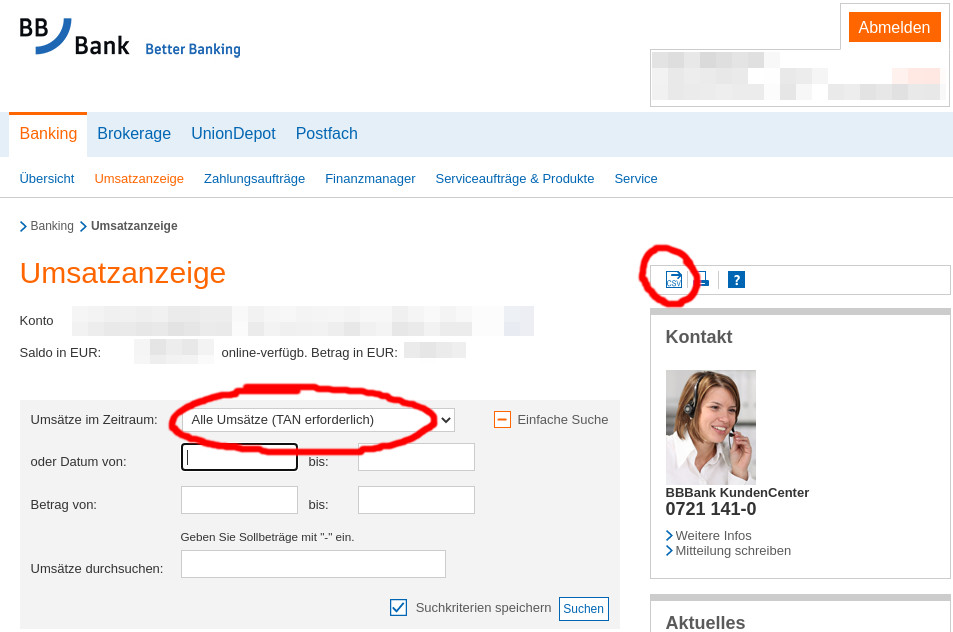

# BBB2HomeBank
Export transactions from BBBank CSVs or monthly statements to HomeBank.

BBBank is a German bank, so the rest of this readme is in German.

## HomeBank
[HomeBank](http://homebank.free.fr/en/index.php) ist ein Programm zur Verwaltung persönlicher Finanzen.
Mit dem Programmen in diesem Repository kann das Übertragen von Kontoumsätzen in HomeBank automatisiert werden.

## Voraussetzungen
Kontoauszüge im pdf-Format können aktuell nur unter Linux umgewandelt werden.
Es werden zusätzlich Java und Apache PDFBox benötigt.

Umsatztabellen im csv-Format können auch unter Windows umgewandelt werden.

## Benutzung
### Kontoauszüge umwandeln
Kontoauszüge im pdf-Format sind im Kundenportal im Postfach zu finden.

Mit `convert_statements.py` kann ein oder mehrere Kontoauszüge in das HomeBank csv Format umgewandelt werden:
```bash
./convert_statements.py kontoauszuege/*.pdf -o output.csv
```

### Umsatztabellen umwandeln
Umsatztabellen können in der Umsatzanzeige heruntergeladen werden.
Da die Daten der Umsatzanzeige nach einiger Zeit gelöscht werden, muss dieser Export regelmäßig durchgeführt werden.


Mit `convert_csv.py` wird die Umsatztabelle dann in das HomeBank csv Format umgewandelt:
```bash
./convert_csv.py Umsaetze_DEXXXXXXXXXXXXXXXXXXXXXX_2020.09.25.csv -o output.csv
```